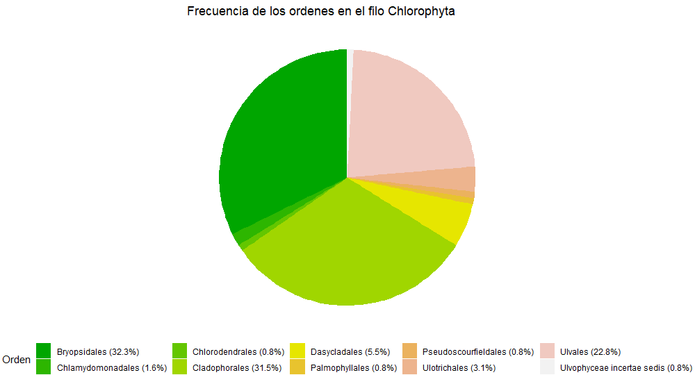
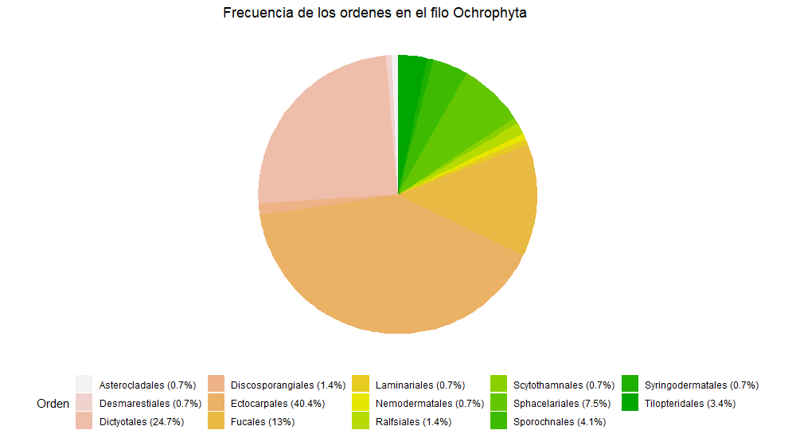
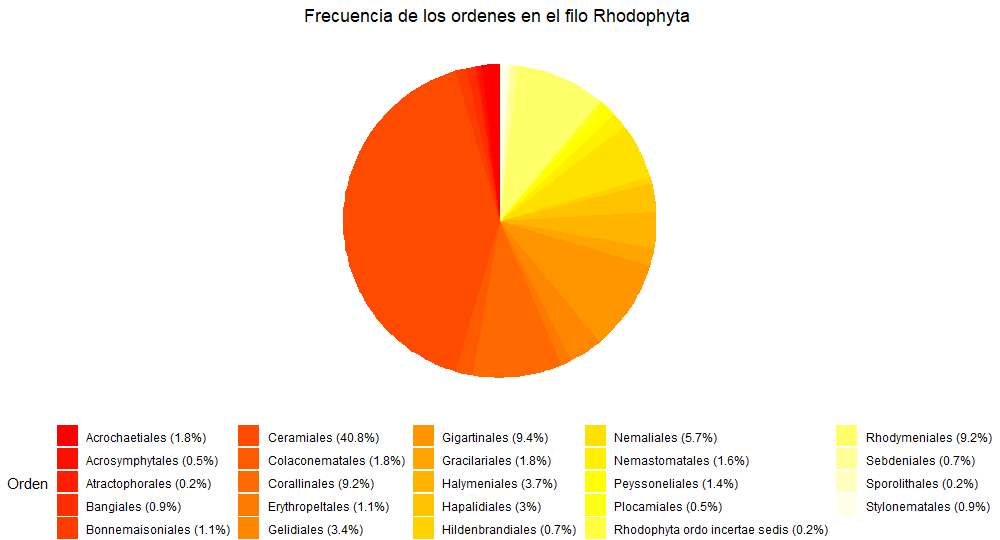
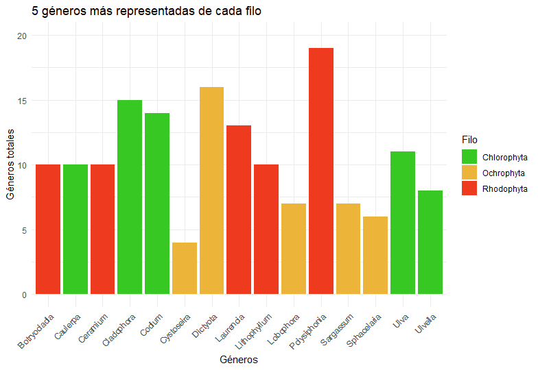

# Algae_analysis
 

In the following folder, you will find the result of an analysis about the number of families and orders of the three large algae phylums found in the Canary Islands (Rodophytes, Chlorophytes and Ocraphytes). As well as seeing which were the fifth most representative genres of each phylum.

